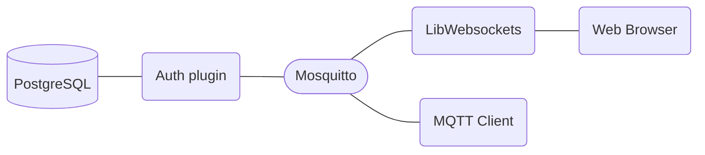

# MQTT服务器需求

- 支持Websocket
- 支持命令行输出json输出
- 支持通过PostgreSQL认证用户



# 源码

## mosquitto 资源

官网源码包下载地址： https://mosquitto.org/download/

- 当前最新版本2.0.6： https://mosquitto.org/files/source/mosquitto-2.0.7.tar.gz

## 官方推荐认证扩展

https://github.com/iegomez/mosquitto-go-auth

# 编译

## 编译 mosquitto

### 安装依赖：

- `gmake` 编译工具
- `cmake` 编译工具
- `libcjson` 命令行支持json格式输出依赖
- `libwebsockets` websocket依赖

```shell
pkg install gmake libcjson
```

根据开发者描述:https://github.com/eclipse/mosquitto/issues/2060
`libwebsockets` 高于`v2.4.2`后会默认关闭`LWS_WITH_EXTERNAL_POLL`选项.导致`mosquitto`功能受损.

所以,要么选择低版本的`libwebsockets`,要么重新手动编译高版本.

这里选择重新手动编译高版本,开启`LWS_WITH_EXTERNAL_POLL`选项.

* `cmake` 编译:

```shell
git clone https://libwebsockets.org/repo/libwebsockets
cd libwebsockets
git checkout v4.1.6
cd ..
mkdir build
cd build
cmake -DLWS_WITH_EXTERNAL_POLL=ON ../libwebsockets
make
make install
```

- `cmake` on MocOS
```shell
cmake -DCMAKE_INSTALL_PREFIX=/usr/local/Cellar/libwebsockets/4.1.6 -DLWS_WITH_EXTERNAL_POLL=ON -DOPENSSL_INCLUDE_DIR=/usr/local/opt/openssl/include -DOPENSSL_EXECUTABLE=/usr/local/opt/openssl/bin/openssl ../libwebsockets
```

### 编译

* `gmake` 编译:

配置`config.mk`

- WITH_WEBSOCKETS:=no -> yes
- WITH_CJSON:=yes

```shell
gmake CFLAGS="-I/usr/local/include" LDFLAGS="-L/usr/local/lib"
gmake install
```

* `cmake` 编译:

```shell
mkdir build
cd build
cmake -DCMAKE_INSTALL_PREFIX=/usr/local -DOPENSSL_ROOT_DIR=/usr/local/opt/openssl -DWITH_WEBSOCKETS=ON -E env LDFLAGS="-L/usr/local/lib" -DCMAKE_C_FLAGS="-I/usr/local/include" ../mosquitto
make
make install
```

## 编译 mosquitto-go-auth

### 安装依赖：

- `go` 编译工具，此为`golang`源码

```shell
pkg install go
```

### 配置国内源

```shell
go env -w GO111MODULE=on
go env -w GOPROXY=https://goproxy.cn,direct
```

### 编译

```shell
gmake
```
