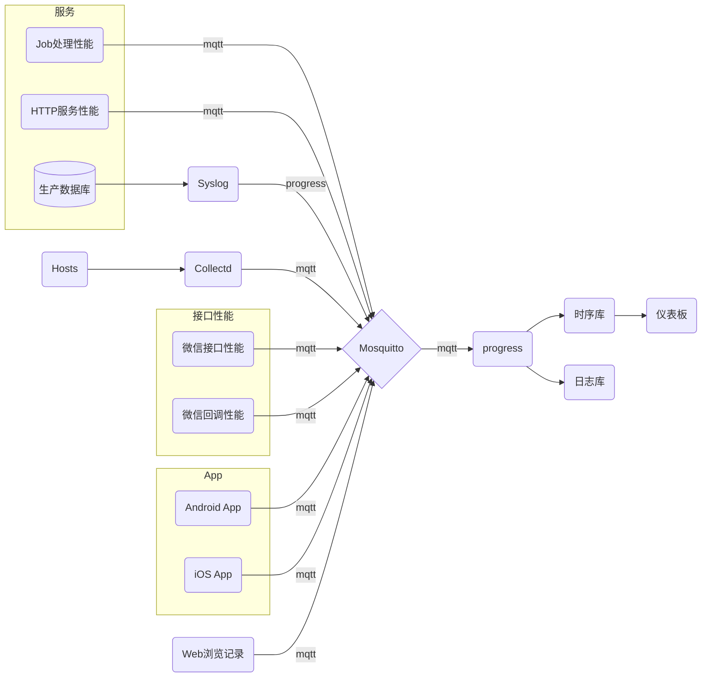

# InfluxDB 使用经历

## InfluxDB v1.x
几年前一直在用InfluxDB v1.x,一直是默认配置。只记录两个`golang`进程的内存、协程、对象、Load数据。
数据记录间隔60秒。所以压力很小。一直相安无事。

2021年8月，决定整理后端混乱的日志。过去的日志数据有部分记录在文件夹中的按天切割的文件中、有记录在syslog中、还有的没有记录、还有部分记录中InfluxDB中，
后端N台ECS没有自己部署监控，这里的数据需至阿里云平台去看，阿里的统计粒度很粗，只能看个大概。所以催生了统一监控+日志的设计需求。
过去使用的是Influx v1.x + Grafana。

## 架构设计

## InfluxDB v2.x
InfluxDB v2 自带了仪表板、图表、监控、通知等功能，这是要大包大揽，要替代grafana的节奏。

### 使用的体验
配置参数使用灵活，支持从v1升级至v2。

但它的单个仪表板中的图表不能太多。数量超过5个，单表线过点，就会导致浏览器卡顿，数量超过8个，就明显影响操作。

当提交的数据频率从`60s/次`，变成几百个数据项`5s/次时`写入，发生了质变。
CPU的`io wait`显著升高。如果换到机械硬盘，不只CPU的`io wait`高到50%，`system load`跑满，`iotop`中`jbd2`的`IO`百分比跑满。
写入延迟过多，还进一步导致MQTT队列堵塞。
<h2>！！糟 透 了！！</h2>
> 在压力之下，世上就没有几个好软件了！

看上去`InfluxDB v2`没有优化写入的性能。我都怀疑一次提交它有可能放大了写入的次数。且过多地使用同步写，导致的。
这样的做法，写入确实是安全了。但是数据压力只要大一点，性能就低到没法使用了。

官方的文档配置部分没有找到写入方面可调优的配置参数。google也没搜索到与此相关的内容。（不知道是不是我使用得太激进了些！）

# TimescaleDB
写入方面的配置，令我想到了PostgreSQL。它在写入方面有不错的优化，也有相当细的配置力度。

所以TimescaleDB插件就成了不错选择。
初步使用感觉：

## 优点
- 安装非常简单，不论是通过APT包装器安装，还是编译安装。都非常简单，也没有什么配置要求。相比`InfluxDB` v2 配置项近百个，好省心！
- 使用也非常简单，只要在普通表上执行个函数就完成转换了。
- 还支持分布式。
- 数据自动转储到`_timescaledb_internal`模式下的表中。且自动为这张表建立了按时间的分段约束表。

## 挑刺
- 侵入性大。`create extension`后，多了6个`schema`对我自己的数据库结构造成了干扰。
