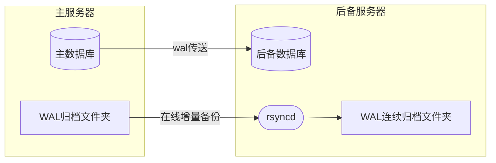

误删是一个无法回避的数据库风险。没有不犯错的人，当数据被误删或被错误数据覆盖，都将造成数据损失。如何实现，既能找回100%丢失的数据，又不大费周章？

## 方案博采&筛选
见常的备份方案有：
- 热备份 - 这个备份对找回数据没有作用
- 定时备份 - 这个方案既耗费资源又无法实现100%找回数据，总有部分数据丢失。数据库越庞大，备份消耗时间越长，要么阻碍线上主库，要么备份失败。
- 文件系统快照 - 这个性能高，但同样无法恢复100%的数据
- 基准备份+WAL归档+流复制+恢复目标限制 - 能实现想恢复到哪个时刻就恢复到哪个时刻，但只能按时间正向恢复；这个可以通过多次尝试的方式弥补。

**基准备份+WAL归档+流复制+恢复目标限制** 的方案是最佳方案。那么如何构建它呢？

## 数据流程图
我们来画个设计图：


## 方案说明
上图中有了两套传送方案：
- `wal传送`流复制用来跟上线上主库最新的数据。
- `在线增量备份`复制归档用来复制旧的WAL归档文件。
这样远和近的所有WAL文件都能在后备服务器上拿到了。
- 
### 关键知识
后备数据库在`postgresql.auto.conf`中配置：
- `primary_conninfo`用于流中恢复
- `restore_command`用于从归档中恢复

另外，关键：还要添加**恢复目标**！如果不添加就启动实例，默认会一路追到主数据库的当前时间点。

PostgreSQL的恢复目标的设置支持很丰富，这里不逐个介绍。我使用恢复到指定时间戳，配置参数为：`recovery_target_time`。
> `recovery_target_time`的精确的停止点还受`recovery_target_inclusive`的影响。影响不大，取默认值即可。
> 它只是定义是否包含边界。

### `rsync`知识
本着**简单的事简单办的原则**，选中了这个古老的工具。
它的使用比较简单：
#### 安装：
```shell
apt install rsync
```
#### `/etc/rsyncd.conf`配置：
```text
hosts allow = x.x.x.x
hosts deny = *
uid = postgres
gid = postgres

[core]
path = /path/to/archive
list = yes
read only = false
comment = PostgreSQL WAL archive
```
#### 重点解说：
- `hosts allow` 允许访问服务的远程IP，可以多个。有了这个就免去了用户认证了。
- `hosts deny` 必须配合 `hosts allow` 指定为`*`，不然孤掌难鸣。
- `read only` 默认为`true`必须明确指定
- `list`、`comment` 可以不设置

#### 服务器端指令
`rsync`的指定很丰富，详细的解释，中文参考[阮一峰的教程](https://www.ruanyifeng.com/blog/2020/08/rsync.html)，英文参考`man rsync`输出的文档。

`rsync`默认就是做的增量同步。

加一个说明，不要使用推荐的 `rsync -a`参数，推荐使用`rsync -r`参数。由于两台服务器用户的`uid`对应的用户，是不一样的。`-a`会把源服务器的文件的所有者属性同步到后备服务器时用户错乱。

`rsync`执行一次，只能做一次同步，它并没有监视文件夹变化的功能。所以这个命令要么配合`inotify-tool`，要么并入PostgreSQL的备份指令中。

我们选择并入PostgreSQL的备份指令中，做法是：修改`postgresql.conf`文件：
```text
archive_command = 'test ! -f /path/to/archive/%f && cp %p /path/to/archive/%f && /usr/bin/rsync -r /path/to/archive/ rsync://x.x.x.x/core'
```
