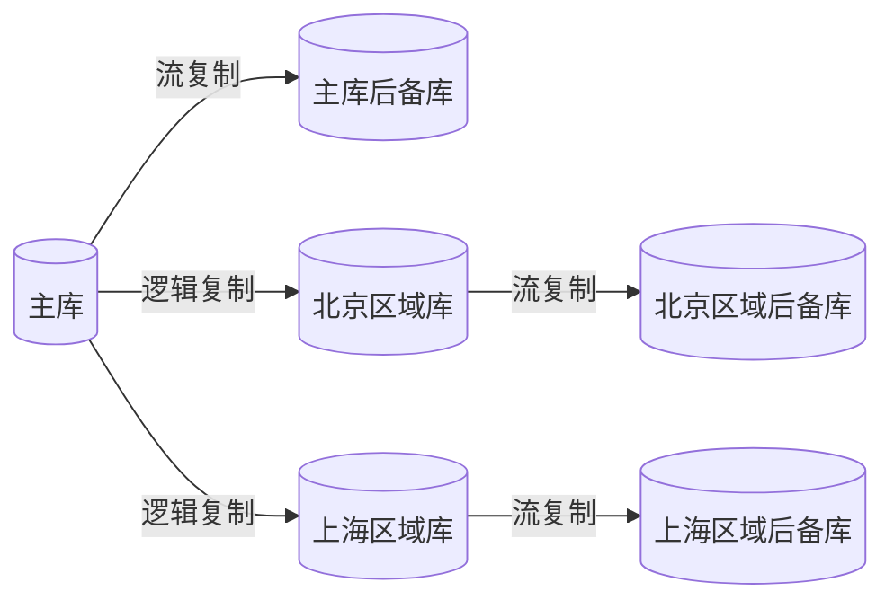
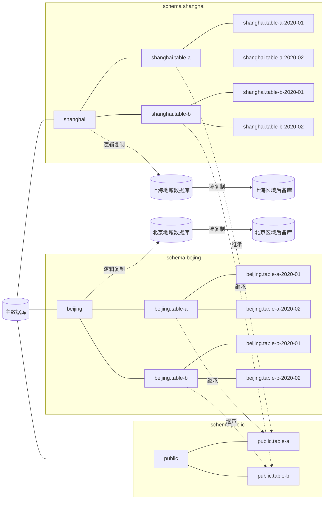

# 设计目标
- 按用户所在地把用户按区域分组，将同一个区域的用户数据集中在当地的数据库中。
- 数据要按时间分表。能按月或按年，方便地处理数据，也能提高查询效率。
- 数据要集中化管理。不能把业务数据弄到不同的库中。最终要有个库中包括平台的所有数据。

# 设计
## 服务实例设计

## 数据库结构设计

## 设计缺陷
- 地域之间的数据迁移
- 地域数据分裂（比如：把上海地区数据库的数据，分裂成：上海、杭州两个子地区）
